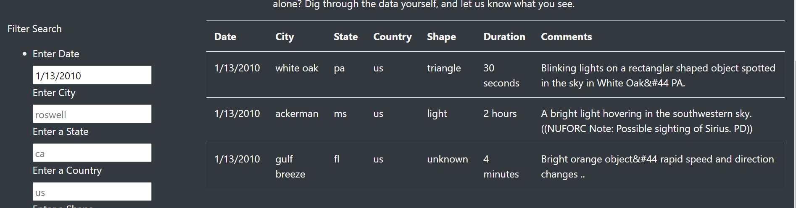
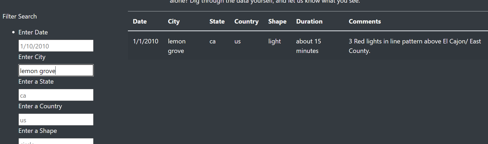
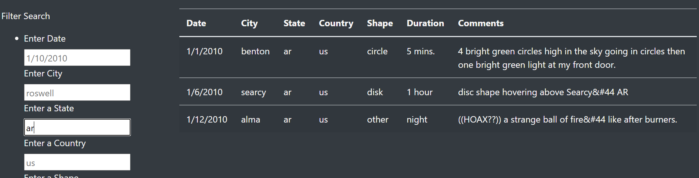
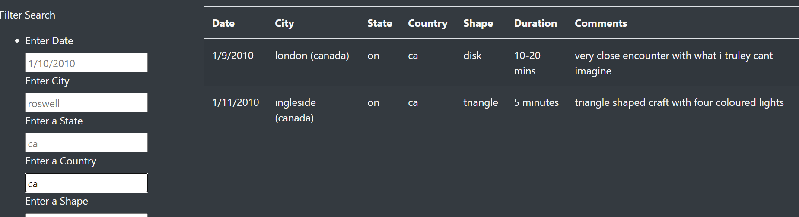
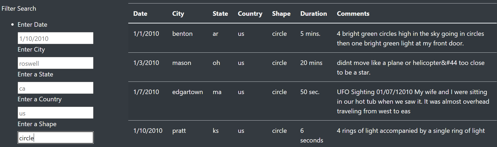

# UFOs
# Overview of Project: 
The purpose of this analysis is to compile UFO sitings in time for World UFO Day.  There is a large amount of data on the topic and we want to break it down into categories that are easy to view.  By creating search filters any individual is able to view specific cities, states, dates, country, and shape of sitings.  
# Results: 
The website has seven different columns to provide clear information on each UFO siting. There are five different ways that a viewer would be able to filter through the data on the webpage.  Below are examples on how to filter through the data and the outcomes that viewers will see. 
## Searching for UFO siting by date
1. Under the filter search section on the left side there is a "Enter Date" box, please enter the date you are searching for
2. Once you have entered the date hit enter and it will produce the outcome you are searching for 

Below is an example of searching for UFO sitings that occurred on 1/13/2010

## Searching for UFO siting by city
1. Under the filter search section on the left side there is a "Enter City" box, please enter the date you are searching for
2. Once you have entered the city hit enter and it will produce the outcome you are searching for 

Below is an example of searching for UFO sitings that occurred in the city of Lemon Grove

## Searching for UFO siting by state
1. Under the filter search section on the left side there is a "Enter State" box, please enter the date you are searching for
2. Once you have entered the state hit enter and it will produce the outcome you are searching for 

Below is an example of searching for UFO sitings that occurred in the state of Arkansas

## Searching for UFO siting by country
1. Under the filter search section on the left side there is a "Enter Country" box, please enter the date you are searching for
2. Once you have entered the country hit enter and it will produce the outcome you are searching for 

Below is an example of searching for UFO sitings that occurred in the country of Canada

## Searching for UFO siting by shape
1. Under the filter search section on the left side there is a "Enter Shape" box, please enter the date you are searching for
2. Once you have entered the shape hit enter and it will produce the outcome you are searching for 

Below is an example of searching for UFO sitings that occurred in the shape of a circle

# Summary: 
The website is well organized and individuals can clearly see the type of data that has been compiled in regards to UFO sitings. 
One drawback to this design is there is no easy way to see which countries have experienced UFO sitings and which ones have not.  In order for viewers to quickly know where sitings have happened is to create a drop down menu for both states and countries. One recommendation is to add a section where individuals are able to state their opinion about the data as the paragraph has a call for action element. Another recommendation is to add a resources section as readers currently do not know where this data was retrieved from. 
